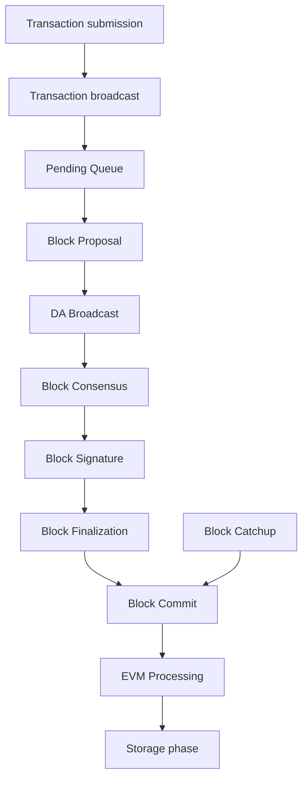
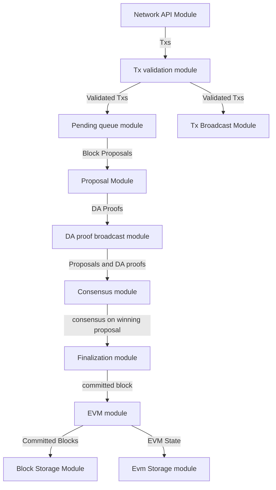

# 1. SKALE Consensus Overview

A SKALE chain is composed of `N` network `nodes` that process `transactions`. 

SKALE consensus is a provably secure algorithm that is used by SKALE chains to order `transactions` into `blocks`.

Consensus blocks finalized immediately, so block time is equal to the finalization time.

## 2. Consensus Architecture

## 2.1 Consensus Phases

During consensus for a particular `blockId` each `node` goes through the following phases

* _Submission phase_ : accept and validate user `transactions`.
* _Broadcast phase_ : broadcast `transactions` to peer nodes.
* _Pending queue phase_: store `transactions` into `pending queues`.
* _Block proposal phase_: create `block proposal` for each `block number` and broadcast it to peers, collecting `2/3 N` `data availability signatures` and creating `DA proofs`. 
* _DA broadcast phase_: broadcast `DA proofs` to peers.
* _Block consensus phase_: run `block consensus` for each `block proposal` to select a `winning proposal`.
* _Block signature phase_: sign `block signature share` (statement that states which proposal won). Broadcast `block signature share` to other nodes. Wait until receipt of 2/3 of `block signature shares`. Merge `block signature shares`  into `block signature`. 
* _Block finalization phase_: commit the `winning proposal` if this `node` has it in storage. Otherwise download `winning proposal` from other nodes. The `winning proposal` becomes a`committed block`. 
* _EVM processing phase_: process the `committed block` through `Ethereum Virtual Machine` to transition to the new `EVM state`. 
* _Storage phase_: store `committed blocks` and `EVM state`.

## 2.2 Typical transaction flow

The diagram below illustrates typical transaction flow:

## 2.3 Normal block processing vs catchup.

In addition to normal block processing, a `node` can receive blocks through `block catchup` mechanism.

`Block catchup` means that the `node` does not participate in `block consensus`. Instead, it simply downloads  `committed blocks` from other `nodes`, verifying `block signatures`. `Block catchup` typically happens when:

*  a node is powered on after being offline,
*  the nework connection of the node is slower than 2/3 of peer nodes, so they reach consensus without node participation.

  `Block catchup` is also be used by `achive nodes` that do not participate in `core chain`.

On core nodes `block consensus` and `block catchup` run in parallel. This means that every node in addition to normal `block consensus` procedure makes periodic random connections to other nodes, to attempt to download ready committed blocks.

## 2.4 Skaled agent overview

Each `node` runs `skaled`, SKALE software PoS blockchain agent. 

`skaled` is composed of:

* `Network API module` accepts `transactions`.
* `Transaction validation module` validates `transactions` on receipt.
* `Pending queue module` holds `transactions`.
* `Transaction broadcast module` broadcasts `valid transactions` to other `nodes` in the chain.
* `Proposal module` creates `block proposals` for consensus.
* `Proposal broadcast module` broadcasts `block proposals` to peers and collects `DA proofs`.
* `DA proof broadcast module` broadcasts `DA proofs` to peers.
* `Consensus module` selects the winning `block proposal` and turns it into a `committed block`, and then creates `block signature` by assembling `signature shares`.
* `Finalization module` downloads winning proposals from other `nodes`, if a node does not have a copy of winning proposal by completion `block consensus`.
* `EVM module` processes the `committed block`.
* `Block storage module` stores `committed blocks`, deleting old blocks if `skaled` runs out of block storage space (`block rotation`).
* `State storage module` stores EVM state.  State information is _never deleted automatically_. Cleaning up the state is the responsibility of dapps.

# 3 Consensus specification

## 3.1 Security assumptions

SKALE is _provably secure_. This means one can prove two qualities of the blockchain

* _consistency_ - for any `block number`, `committed blocks` and `EVM state` are identical on each `node`.  Note, that due to network delays,
some `nodes` may at a given moment have less `committed blocks` than others. Therefore, `the consistency is eventual`.
* _liveliness_ - the blockchain will always keep producing new `committed blocks`. 

Provable security means that _under certain mathematical assumptions_, SKALE chain _will always be  consistent and lively, no matter what the attacker does_.

The mathematical assumptions for provable security are specified below.

### 3.1.1. Node security assumptions 

We assume that out of `N` `nodes`, `t` `nodes` at maximum are Byzantine (malicious), where

`3t+1 < = N`

Simply speaking, not more than 1/3 of `nodes` can be malicious. For instance, if `N = 16`, the maximum number of `malicious nodes` is `5`.

The identity of `malicious nodes` is not known. A malicious `node` will typically pretend being an `honest node`.

A `malicious node` will attempt to break the consistency and liveliness of the network by sending `malicious messages`, or not sending 
any `messages`, when it supposed to send a `message` by the protocol.

It is assumed that `malicious nodes` do not control network routers and links. This means that `malicious nodes` can not affect `messages` sent between `honest nodes`, such as corrupting or reordering them.

# 3.1.2 Network security assumptions

The algorithms used by SKALE make assumptions about _the properties of the underlying network_.

SKALE assumes that _the network is asynchronous and reliable with eventual delivery guarantee_.

This means that:

* `Nodes` are assumed to be connected by _reliable communication links_. 
* Links can can be arbitrarily slow, but will eventually deliver `messages`.

The asynchronous model described above is _similar to the model assumed by Bitcoin and Ethereum blockchains_. It reflects *the state of modern Internet*, where temporary network splits and interruptions are normal, but always resolve eventually.

Since real Internet sometimes drops `messages` on the way without delivering them, _the eventual delivery guarantee is achieved in practice by retransmissions_. The `sending node` will make _multiple attempts to transfer_  `message` to the `receiving node`, until the transfer is successful and is confirmed by the `receiving node`.

## 3.2 Node priority

For each `block id` each `node` is assigned integer `priority`. The `priority` is used to determine the winner of consensus.

`Node priority` changes in a round-robin fashion from one `block` to another. For the `first block`, the `first node` has the highest `priority` or is a `priority leader`. For the second block the `second node` is the `priority leader` and so on.

In general, node priority can be expressed by the following formula

`nodePriority = N - ((nodeIndex - blockId ) mod N)`

Here `nodeIndex` is the integer index of the `node` in the chain from `1` to `N`.  As an example: for `blockId = 5` and `N = 16`, `node 5` has priority `16`, `node 6` has `priority` `15` and so on, ending with `node` `4` having `priority` `1`.

It is easy to see from the above expression, that 

`priorityLeader = (nodeIndex - blockId ) mod N + 1`

## 3.3 Default block

Sometimes (very infrequently) no `node` wins consensus. In such cases, `block consensus` can result in an `empty block` that no-one proposed, named `default block`.

## 3.4 Full and Optimized Block Consensus

For each `block`, nodes need to propose and agree on a block. Once this happens, the `block` is finalized (signed) and committed to the chain. This is referred to as `block consensus`.

SKALE utilizes two types of block consensus: `full consensus` and `optimized consensus`.

During `full consensus`, all nodes compete to propose and create a `block`.  The winner is determined by competition. If there are multiple potential winners the ultimate winner is selected by _choosing the highest priority node_ out of the candidates.

During optimized consensus, only the winner of the previous consensus at `blockId = currentBlockId - N` is allowed to propose and win. This saves lots of network bandwidth. Essentially _the purpose of the optimized consensus is to let the previous winner win_.

As an example, for block `18`, the winner of the consensus at block `2` was `node 3` is allowed to propose and win.

The full consensus will run for first `N` `blocks`, and then will be re-run every `4 N + 1` `blocks` (65 `blocks`). The reason to re-run the `full consensus` is to see if network conditions changed. For most `blocks`, optimized consensus will run that will utilize the `previous winner`.

Full comsensus will also rerun if there is no `previous winner`, meaning that previous consensus ended with a `default block`.

## 3.5 Consensus phases

### 3.5.1 Submission phase

During submission phase a `user client` (browser or mobile app) signs a `transaction` using user `private wallet key` and submits it either directly to one of `core nodes`, or to a `network proxy`,  or to an `archive node`. 

A `network proxy` is a `node` that load balances incoming transactions to `core nodes` attempting to load them evenly, and avoiding transaction submissions to non-responsive `nodes`. 

An `archive node` is a `node` that does not participate in consensus, but stores a historic copy of the state as well as broadcasts transactions to core `nodes`.

### 3.5.2 Broadcast phase

During the broadcast phase, a `core node` or an `archive node` that has received a `transaction` from `user client` will broadcast it to all `core nodes`. 

### 3.5.3 Pending queue phase

A `transaction` received from `user client` or from `transaction broadcast` is validated and placed into the`pending queue`.
During the validation, `transaction signature` and format are verified. 

`Pending queue` has fixed memory capacity. If the `pending queue` is full, adding a new `transaction` to the `queue` will cause some `transactions` to be dropped from the `pending queue`. Ethereum-compatible blockchains, including SKALE, drop transactions habing the smallest `gas price`.

Pending queues on different core nodes will typically look similar but not identical due to network and computational delays.

### 3.5.4 Block proposals and DA proofs.

A `block proposal` is an ordered list of `transactions`, signed by the `proposing node`.

A `DA proof` is a `data availability proof` that a proposal has been distributed to 2/3 nodes on the network. To create a `DA proof`, `proposer node` uploads the proposal to at least 2/3 nodes in the network. On each upload the `receiving node` signs a `DA proof signature share` that confirms receipt of the proposal.  The `proposing node` will then merge `2/3 N` signature shares into a `threshold signature`. This threshold signatue is a `data availability proof` `DA proof`.

`DA proof` signifies that the proposal has been widely distributed to the network.  If a particular `node` does not have the proposal, it can download it from one of `2/3 N` nodes, out of which at least `1/3 N` are honest.

`DA proof` also signifies uniqueness of proposal for a particular block ID. It is mathematically impossible for a `malicious proposer` to collect `2/3 N` signature on two conflicting proposals.

To summarize, `DA proof` forces the proposer to be `non-malicious`. The `proposal` is enforced to be widely distributed and unique.

### 3.5.5 Block proposal phase (full consensus)

For each `block id`, _each SKALE node_ will form a `block proposal`.  

If all `transactions` in `pending queue` can be placed into proposal without reaching `block gas limit`, then all `transactions` will be placed into `block proposal`. Otherwise, `transactions` with higher gas price will be selected from the queue to create a `block proposal` that fits the `block gas limit`. 

Once a `node` created a proposal, it will broadcast `compressed proposal` to all its nodes. The compressed proposal includes only the `transaction hash` (fingerprint) of each transaction. The `receiving node` decompresses `transactions` by matching `transaction hashes` to `transactions` stored in is pending queue. In the event `receiving node` does not have a matching `transaction` in its pending queue, it will ask the `sending node` for the entire `transaction`.

Once the `receiving node` receives the `block proposal`, it will sign a `DA signature share` and pass it to the `sending node`. 

Once the `sending node` collects `DA signatures` from `2/3` of nodes, it will merge the signatures into a `DA proof`. The `DA proof` proves that the proposal has been widely distributed over the network.

### 3.5.6 Block proposal phase (optimized consensus)

For optimized consensus only the `previos winner` will form and broadcast a proposal, and collect a `DA proof` for it.

So there is only one `proposal` and one `DA proof, which leads to way lower network load and faster completion of the `proposal phase`.

### 3.5.7 DA broadcast phase (full consensus)

For each node, once a `node` obtains a `DA proof` for its `block proposal`, it will broadcast `DA proof` to all other nodes.

There are, therefore, `N` 'DA proofs` broadcast in total.

### 3.5.7 DA broadcast phase (optimized)

The `previous winner node`, once a `previous node` obtains a `DA proof` for its `block proposal`, it will broadcast `DA proof` to all other nodes.

There is, therefore, only one `DA proof` broadcast.

### 3.5.8 Block consensus phase (full consensus)

Block consensus means that all honest need to agree on a winning proposal. Block consensus utilizes running multiple instances of `binary consensus algorithm` 

See here for an introduction into asynchronous binary consensus.

https://en.wikipedia.org/wiki/Consensus_(computer_science)

#### 3.5.8.1 Binary consensuses start

Once a node receives `DA proofs` from 2/3 of nodes, the node will start the block consensus phase. It will also start block consensus phase if a `proposal timeout` is reached, even with less than 2/3 proofs.

During block consensus phase, the `node` will vote `1` if it received both `proposal` and `DA proof` from a particular proposer, and vote `0` otherwise.

Therefore, each node starts with a binary string of `N` ones and zeroes. The string will include at least `2/3 N` ones.

As an example `101101101111101`

For each binary proposal, a separate binary consensus is executed. Therefore, there are `N` binary consensuses executed in total.

#### 3.5.8.2 Binary conensuses execute

The binary consensus executed is the algorithm described in  https://inria.hal.science/hal-00944019/file/RR-2016-Consensus-optimal-V5.pdf

This algorithm has the following provable properties:

* initially each `node` votes `1' or `0`. So when the algorithm starts, there is no consensus.
* nodes exchange vote messages as described in the algorithm. 
* the always completes in final time.
* when the algorithm completes, it completes with ether `1` or `0` consensus on all nodes
* if the algorithm completes with 1, there is at least one honest nodes that initially voted 1.
* if all honest nodes initially vote 1, there resulting consensus will be one.
* the more honest nodes initially vote 1, the more is the probability that the resulting consensus will be `1`

#### 3.5.8.3 Binary consensuses complete

When `N` binary consensuses complete, each of them arrives at either `1` or '0`

If the consensus completes with `1` it is guaranteed that `1` was initially voted by at least one honest node. That, in turn, guarantees that the particular `block proposal` was `DA safe`, or that it is widely distributed over the network.

* If only one binary consensus completes with one, and the rest complete with zero, then _the proposal corresponding to this consensus  is decided as a block_.
* If a `block consensus` phase outputs `1` for several proposals, _the proposal with highest priority is decided_. 

* In the rare case of alll binary consensuses returning `0` it typically means a major network problem that did not allow nodes to distribute proposals. In this case, a _default block is decided_.

### 3.5.9 Block consensus phase (optimized consensus)

#### 3.5.9.1 Binary consensus start

Once a node receives `DA proof` from `last winner`, the node will start the binary consensus. It will also start binary consensus if a `proposal timeout` is reached and no proposal is received from the `last winner`

During binary consensus phase, a `node` will vote `1` if it received both `proposal` and `DA proof` from the `last winner`, and vote `0` otherwise.

Therefore, only one binary consensus is started.

#### 3.5.9.2 Binary conensuses execute

The binary consensus executed is the algorithm described in  https://inria.hal.science/hal-00944019/file/RR-2016-Consensus-optimal-V5.pdf

#### 3.5.9.3 Binary consensuses complete

When binary consensuses completes, it outputs at either `1` or '0`

* If the consensus completes with `1` it is guaranteed that `1` was initially voted by at least one honest node. That, in turn, guarantees that the `block proposal` from `previos winner` was `DA safe`, or that it is widely distributed over the network.

* If the consensus completes with `0` it means that the previous winner did not propose (crashed), or did not distribute the proposal widely on the network. It this rare case _a default block is decided_.

### 3.5.10  Block  signature phase

After `block consensus` decides on the winning block, each node will sign the statement specifying the winning proposal (`block signature share`) and broadcast it to other nodes.

The node will then:

* wait until receipt of 2/3 of `block signature shares`
* merge the shares into `block signature`.

### 3.5.11  Block  signature phase 

On completion of _block signature phase_, all honest nodes will have the `block signature` but some of them may not have the block itself. 

This can happen due to a malicious proposer, that intentionally does not send its proposals to some of the all nodes in order to break the liveliness property of the blocklchain. It can also happen due to proposer crashing, or due to slow network.

Fortunately, `DA proof` requirement solves the problem.  It is guaranteed, that `block proposal` that is decided wins _block consensus phase_ has `DA proof`, and is, therefore, widely distributed across the network.

Therefore, during _block finalization_phase_ If a `node` does not happen to have the `winning proposal`, it will simply connect to other `nodes` to download it from them. 

Note that 2/3 of the nodes are guaranteed to have a copy of the proposal after _DA proof phase_

### 3.5.12  EVM processing phase

After block finalization the committed block is present on the node.

Then:

* The node will  remove the matching transactions from the transaction queue.

* The block will be then processed through Ethereum Virtual Machine to update `EVM state`.

### 3.5.13  Storage phase

During the storage phas

* `Committed block` will be stored in persistent storage, and 
* `EVM state` will be updated in persistent storage.

The node will then move into _block proposal phase_ for the next block. This completes the cycle.

# 4. Behavior in case of network failures and crashes

## 4.1 Achieving eventual delivery by retransmissions

Since real Internet sometimes drops messages on the way without delivering them, _the eventual delivery guarantee is achieved in practice by retransmissions_. The `sending node` will make _multiple attempts to transfer_  `message` to the `receiving node`, until the transfer is successful and is confirmed by the `receiving node`.

Each `sending node` maintains a separate `outgoing message queue` for each `receiving node`. To schedule a `message` for delivery to a particular node, `message` is placed into the corresponding `outgoing message queue`.

Each `outgoing message queue` is serviced by a separate program `thread`. The `thread` reads `messages` from the `queue` and attempts to transfer them to the `destination node`. If the `destination node` temporarily does not accept `messages`, the `thread` will keep initiating transfer attempts until the `message` is delivered. The `destination node` can, therefore, temporarily go offline without causing `messages` to be lost.

Since there is a dedicated `message sending thread` for each `destination node`, `messages` are sent independently. Failure of a particular `destination node` to accept `messages` will not affect receipt of `messages` by other `nodes`.

In the remainder of this document, anywhere where it is specified that a `message` is sent from `node` `A` to `B`, we mean reliable independent delivery as described above.

## 4.2 Consensus state

Each node stores _consensus state_. For each round of consensus, consensus state includes the set of proposed blocks, as well as the state variables of the protocols used by the consensus round.

The state is stored in non-volatile memory and preserved across reboots.

## 4.3 Reboots and crashes

During `_A_`, a node will temporarily become unavailable. After a reboot, messages destined to the node will be delivered to the node. Therefore, a reboot does not disrupt operation of asynchronous consensus.

Since consensus protocol state is not lost during a reboot, a node reboot will be interpreted by its peers as a temporarily slowdown of network links connected to the node.

A is an event, where a node loses all of parts of the consensus state. For instance, a node can lose received block proposals or values of protocol variables.

A hard crash can happen in case of a software bug or a hardware failure. It also can happen if a node stays offline for a very long time. In this case, the outgoing message queues of nodes sending messages to this node will overflow, and the nodes will start dropping older messages. This will lead to a loss of a protocol state.

## 4.4 Default queue lifetime

This specification specifies one hour as a default lifetime of a message which has been placed into an outgoing queue. Messages older than one hour may be dropped from the message queues. A reboot, which took less than an hour is, therefore, guaranteed to be a a normal reboot.

## 4.5 Limited hard crashes

Hard crashes are permitted by the consensus protocol, as long as not too many nodes crash at the same time. Since a crashed node does not conform to the consensus protocol, it counts as a Byzantine node for the consensus round, in which the state was lost. Therefore, only a limited number of concurrent hard crashes can exist at a given moment in time. The sum of crashed nodes and byzantine nodes can not be more than `t` in the equation (1). Then the crash is qualified as a limited hard crash.

During a limited hard crash, other nodes continue block generation and consensus. The blockchain continues to grow. When a crashed node is back online, it will sync its blockchain with other nodes using a catchup procedure described in this document, and start participating in consensus.

## 4.6 Widespread crashes

A widespread crash is a crash where the sum of crashed nodes and Byzantine nodes is more than $t$.

During a _widespread crash_ a large proportion of nodes or all nodes may lose the state for a particular round and consensus progress may stall. The blockchain, therefore, may lose its liveliness.

Security of the blockchain will be preserved, since adding a new block to blockchain requires a supermajority threshold signature of nodes, as described later in this document.

The simplest example of a widespread crash is when more than 1/3 of nodes are powered off. In this case, consensus will stall. When the nodes are back online, consensus will start working again.

In real life, a widespread crash can happen due to to a software bug affecting a large proportion of nodes. As an example, after a software update all nodes in an schain may experience the same bug.

## 4.7 Failure resolution protocol

In a case of a catastrophic failure a separate failure resolution protocol is used to restart consensus.

First, nodes will detect a catastrophic failure by detecting absence of new block commits for a long time.

Second, nodes will execute a failure recovery protocol that utilizes Ethereum main chain for coordination. Each node will stop consensus operation. The nodes will then sync their blockchains replicas, and agree on time to restart consensus.

Finally, after a period of mandatory silence, nodes will start consensus at an agreed time point in the future.

# 5. Data structures format

## 5.1 Transactions

Each user transaction `T` is assumed to be an Ethereum-compatible transaction, represented as a sequence of bytes.

## 5.2 Block

Each block is a byte string, which includes a header followed by a body.

## 5.2.1 Block header

Block header is a JSON object that includes the following:

* `blockId*` - integer id of the current block, starting from 0 and incremented by 1
* `blockProposer*` - integer id of the node that proposed the block.
* `previousBlockHash` - SHA-3 hash of the previous block
* `blockHash` - the hash of the current block
* `transactionCount` - count of transactions in the current block
* `transactionSizes` - an array of transaction sizes in the current block
* `proposerSig` - ECDSA signature of the proposer of this  block
* `thresholdSig*` - BLS supermajority threshold signature of JSON object that includes winning `block proposer index` and `block_id`.
* `daProof` - `DA proof threshold signature of JSON object that includes `block_id`, `block proposer index` and `block_hash`

Note: All integers in this spec are unsigned 64-bit integers unless specified otherwise.

## 5.2.2 Block body

`BLOCK BODY` is a concatenated byte string of all transactions in the block.

## 5.2.3 Block hash

Block proposal hash is calculated by taking hash of 

* block header, while omitting `BLOCK HASH`, `BLOCK SIG`, and `TSIG` from the header. The reason why these fields are omitted is because they are not known at the time block proposal is hashed and signed.
* concatenated with `block body`

